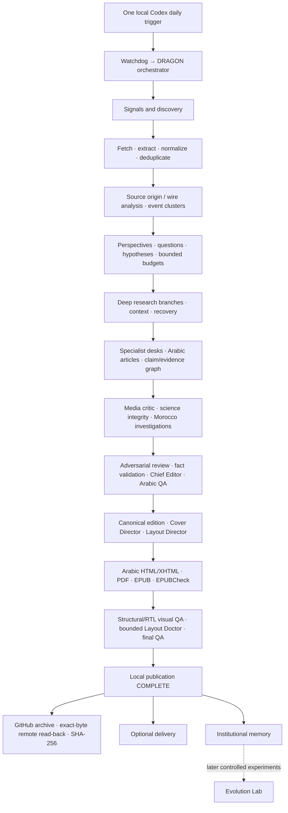

# DRAGON

DRAGON is a newspaper project focused on Morocco and Meknes, with national,
world, Palestine, science, AI, history, literature and culture, opinion,
investigation, and public-service desks. The intended product is a substantial
professional Arabic newspaper with evidence-linked journalism, a canonical
cover, flexible pagination, and validated PDF and reflowable EPUB editions.

**The current design is V5: one local Codex daily trigger, one Windows
orchestrator, Arabic reader content. Full unattended production is not accepted.**
The engineering goal is **“DRAGON reliably wakes up finished.”** It remains a
goal until genuine production editions, human reviews, remote archive evidence,
and consecutive unattended runs satisfy the cutover gate.

V5 is the authoritative implementation target.
[SPEC-v5.md](SPEC-v5.md) is the authoritative implementation contract;
[LOCAL-AUTOMATION.md](docs/LOCAL-AUTOMATION.md) and
[local-automation.yaml](config/local-automation.yaml) define operation.
The five-job V4 runtime is a retained migration fallback, not the future design.
Repository reconciliation does not activate production or retire those jobs.

# Current Project Status

Status vocabulary: **DESIGN LOCKED** = agreed target; **IMPLEMENTED** = code
exists; **TESTED OFFLINE** = deterministic fixtures/integration tests pass;
**PARTIALLY VERIFIED** = some machine or live evidence exists, with stated limits;
**PLANNED / NOT YET IMPLEMENTED** = missing capability; **BLOCKED** = acceptance
requirements remain unmet. A fixture PASS never establishes live editorial
quality. **VERIFIED** is used only for the explicitly named scope, and
**PRODUCTION ACCEPTED** requires the full unattended acceptance plan.

The reconciliation audit is dated **2026-10-05, Africa/Casablanca**. Exact Git
lineage, test commands/counts, live outcome and preservation checks are in
[REPOSITORY-RECONCILIATION-2026-10-05.md](docs/REPOSITORY-RECONCILIATION-2026-10-05.md).
Local sealed evidence is retained outside disposable worktrees; its absence
from a clone must not be confused with portable production proof.

The October 5 fresh trial made one provider call and 16 native actions within
the unchanged two-epoch budget. Both hard lanes remained
`BLOCKED_BUDGET_BEFORE_REQUIRED_SEARCH`; research stopped at
`RESEARCH_RECOVERY_REQUIRED` before article generation. Fetching 13 pages,
including eight discovered child URLs, did not produce an accepted hard-lane
evidence bundle. The complete regression suite passed **994 tests, with two
Windows rendering skips**. These results establish a tested development
baseline, not unattended production acceptance.

| System | Status | What exists now | What still remains |
| --- | --- | --- | --- |
| Core architecture | DESIGN LOCKED / IMPLEMENTED | V5 contract, 26-stage dependency graph, local CLI | Whole-product production acceptance |
| One-trigger orchestration | TESTED OFFLINE | Scheduler contract, watchdog, one daily owner | Existing Codex automation is PAUSED; activation/trial gate |
| State/finality | TESTED OFFLINE | Atomic writes, backup, hashes, lock, runtime identity, `ALREADY_PUBLISHED` | Real unattended interruption/resume observations |
| Research discovery | PARTIALLY VERIFIED | Provider registry, RSS/seed discovery, bounded fetch, local SearXNG | Reliable fresh coverage across all desks |
| Hard semantic breadth | TESTED OFFLINE | Research-start planning, distinct-event and semantic requirements | Fresh evidence closure under fixed budget |
| ACCOUNTABILITY lane | PARTIALLY VERIFIED / live BLOCKED | Hard targets, exclusions, native ladders, mandatory reservations | October 5: 10 required searches missing; no accepted current oversight bundle |
| SERVICE lane | PARTIALLY VERIFIED / live BLOCKED | Operational targets, deadline typing, current-operation checks | October 5: eight required searches missing; no accepted current original service bundle |
| Exact-artifact retrieval | PARTIALLY VERIFIED | Index/link discovery, child fetches, identifiers, post-fetch qualification | Exact links can still fail acquisition or evidence acceptance |
| Provider targeting | PARTIALLY VERIFIED | Actual request/prompt capture, hard dispositions, schema/payload preflight | Consistent live target response and evidence closure |
| Claim/evidence graph | TESTED OFFLINE | Exact source IDs, locators, support, contradictions, confidence | Review a real complete Arabic edition |
| Source-origin analysis | TESTED OFFLINE | Wire/copy lineage, deduplication, event clusters, original-source routing | Broad live robustness |
| Evidence gates | TESTED OFFLINE | PRIMARY, independence, temporal, semantic, contested/science/P0 checks | Real coverage that satisfies every applicable gate |
| Super Investigation | PARTIAL | Persistent dossiers/timelines, evidence edges, readiness and scope guard | Mature bounded Morocco investigation workflow |
| Science engine | PARTIAL | Paper passports and integrity gates | Literature/full-text discovery and external scientific adapters |
| History engine | PLANNED / NOT YET IMPLEMENTED | History desk in section inventory | Book-first ingestion, historiography, OCR/archives, historical graph |
| Chief Editor | TESTED OFFLINE / live quality BLOCKED | Structure, ranking, budgets, active-or-explained decisions | Human-reviewed coherent real newspaper |
| Arabic editorial generation | PARTIAL | ChatGPT-authenticated Codex command adapter, Arabic schema/QA | Proven end-to-end editorial integration; config remains `NOT_RUN` |
| Cover system | TESTED OFFLINE | Cover thesis/brief, hero/text separation, variants, canonical cover hashes | Human-reviewed real cover/art direction |
| Layout Director | TESTED OFFLINE | Functional page grammars, layout plan, bounded Layout Doctor | Real newspaper typography and flow acceptance |
| Arabic HTML/XHTML | TESTED OFFLINE | `lang="ar"`, `dir="rtl"`, localized design assets | Real edition review and broader resource portability |
| PDF | PARTIALLY VERIFIED | Real fixture PDFs; Pillow RTL on Windows, WeasyPrint elsewhere | Human visual acceptance on real long-form editions |
| EPUB | PARTIALLY VERIFIED | Native reflowable builder, Arabic metadata, RTL spine, canonical cover | Real-reader/device review |
| EPUBCheck | IMPLEMENTED / fixture MACHINE PASS | Pinned W3C 5.3.0 CLI and persisted diagnostics/JAR identity | Installed Java/JAR plus PASS on every production EPUB |
| RTL visual QA | PARTIAL | Contact sheets, structural/raster checks, Arabic extraction checks | Human review of shaping, order, clipping, mixed-script typography |
| GitHub publication/read-back | PARTIALLY VERIFIED | Exact-byte Git round-trip, stale-ref rejection; historical remote fixtures | New real V5 edition archive; archive provider remains disabled |
| Institutional memory | PARTIAL | Hash-accepted continuity snapshots, dossier persistence, metrics | Mature cross-edition research/knowledge memory |
| Evolution Lab | PARTIAL foundation / later-stage PLANNED | Metrics, fixed-dimension comparison, feedback queue, no auto-promotion | Controlled candidate execution and independent evaluator |
| Full unattended daily production | BLOCKED | Synthetic pipeline and component acceptance | Real edition, reviews, three consecutive watchdog dates, activation evidence |

## Product and editorial direction

Reader-facing headlines, body, captions, cover text and publication metadata
are Arabic. Technical proper nouns may retain official spelling. Bylines come
from configuration (`تحرير: <PEN_NAME>`). DRAGON must not imply field reporting,
interviews, eyewitness presence or access that never occurred.

The section inventory is preserved from V4. Each section is active or has a
specific explained omission. Evidence and story type determine the form and
length; page count expands before verified journalism is cut. The repeated
visible “What happened / Why it matters / What to watch” card is prohibited.

**DESIGN LOCKED, editorial quality not yet accepted:** the Argument Staircase
moves observation → evidence → interpretation → context → conclusion/question.
Accordion Zoom moves a local/current event through national or global and
historical context, then returns to Moroccan consequences. Quotations serve as
evidence or analytical montage. Dry understatement may expose contradictions in
claims or institutions; humor must never change factual meaning or target
ordinary people. Any future anti-slop/humanizer is style linting only: it cannot
change claims, quotations, figures, evidence or citations.

## Production architecture

This diagram shows the intended complete path. The status table distinguishes
implemented foundations from unaccepted or planned capability.



Actual stage order lives in the contract and `dragon/pipeline.py`:

```text
preflight → source_monitoring → research → source_intelligence → research_planning
→ deep_research → deep_research_execution → research_recovery → article_generation
→ claim_evidence_graph → media_critic → science_integrity → investigation_engine
→ adversarial_review → factcheck → chief_editor → arabic_language_qa
→ cover_direction → cover → layout_direction → publication_source → pdf → epub
→ final_qa → github_archive → whatsapp_delivery
```

Research branch planning is implemented; the deterministic executor performs
bounded action rounds. The diagram's parallel deep-research ambition must not
be read as proof of a fully parallel autonomous newsroom today.

## One-trigger execution model

Exactly one local Codex daily automation is the target. Its canonical command
is `python dragon_watchdog.py`; the watchdog starts/resumes the supported
`python dragon_daily.py` entry point. There are no independent desk, cover or
publisher schedules and no added Task Scheduler/cron/systemd control plane.
The configured target window is 07:00–10:30 **Africa/Casablanca**, not UTC.
Both scheduler configuration and cutover activation remain disabled.

A daily process lock, owner PID and heartbeat prevent duplicate execution.
The watchdog assesses live, dead, corrupt and missing-state cases; it does not
restart a live process merely because a heartbeat is late. Resume validates
checkpoint inputs/outputs and acceptance criteria. `--retry STAGE` targets that
stage and its dependents. Runtime fingerprint drift blocks ordinary resume.
Completed editions remain immutable; corrections require explicit new inputs.

A missed trigger can start today's missing state or resume today's interrupted
run when invoked; there is no accepted unattended multi-day catch-up system.
Dependency outages and missed deadlines are reported truthfully. Technical
research acceptance after the deadline is separately labelled and cannot prove
on-time production. See [recovery operation](docs/RECOVERY-RUNBOOK.md).

## Research and evidence architecture

Discovery is generous; acceptance is strict. RSS, search results, social hints,
provider suggestions and listing pages identify possibilities, not facts.
Fetched pages are untrusted data and cannot change DRAGON's policy or commands.
Source registry, bounded extraction, origin analysis, event clustering,
question trees and research budgets belong to deterministic code.

The current frontier includes research-start hard semantic coverage,
deficit-aware ACCOUNTABILITY and SERVICE routing, mandatory ladder reservations,
general opportunity fairness, carried request/job lineage, closure telemetry,
exact issuer artifact routes, child fetches and post-fetch qualification.
Provider inputs include unresolved hard targets, mechanisms, exclusions,
current-operation guidance and a discovery-only warning. Provider output never
owns executable actions, evidence promotion or deficit closure.

The executor retains **8 actions per round and two recovery epochs (8 + 8)**.
Search/fetch/lead-follow-up allowances are additional bounds in
[deep-research.yaml](config/deep-research.yaml), not permissions to expand the
edition ceiling. Pending work and capacity failures remain explicit.

An exact link alone cannot close a hard deficit: the child artifact must be
fetched, normalized, classified and accepted. ACCOUNTABILITY requires concrete
substantive oversight, enforcement or equivalent accountability action; routine
institutional participation is excluded. SERVICE requires an actionable current
operational change or public fact with the required original support; generic
descriptions and future-only announcements cannot stand in for current operation.

PRIMARY, independent-origin, semantic, temporal, source-origin, contested-claim,
science, service-fact and P0 requirements remain authoritative. Copying the same
wire story across publishers never creates independent verification.

The claim graph links claims to source IDs, precise support/locators, origins,
contradictions and uncertainty. Missing evidence remains blocked/pending.
Research finality distinguishes a validated event from a verified absence of a
qualifying event in a bounded universe/window. Failed transport, incomplete
protocols, pending leads and exhausted capacity do not establish absence.
Verified absence adds no event or article credit and creates no filler.

Read [deep research](docs/DEEP-RESEARCH-ENGINE.md),
[executor](docs/DEEP-RESEARCH-EXECUTOR.md),
[hard-lane completion](docs/HARD-LANE-COMPLETION.md),
[research finality](docs/RESEARCH-FINALITY.md), and
[durable acceptance bundles](docs/ACCEPTANCE-BUNDLES.md).

## Specialist desks and scope

**Super Investigation — PARTIAL.** Persistent dossier, timeline, source/claim
graph and readiness checks exist. The deliberate scope is Morocco, including
Meknes/Fes-Meknes where relevant. Foreign entities require an evidence-linked
connection to that scope. Other desks can conduct deep research, source
comparison, verification and adversarial review without becoming a limitless
global persistent investigation engine. Accountability does not presuppose
scandal: mixed or insufficient evidence, unsupported claims, no evidence of
misconduct, an explanation found, and a project/service actually delivered are
legitimate findings.

**Science engine — PARTIAL foundations; external integrations PLANNED.**
`dragon/science.py` checks paper passports, DOI/metadata consistency, publication
status, abstract versus full-text access, methods/limitations, claim alignment,
correlation versus causation, conflicting studies and corrections/retractions.
It does not itself prove a complete literature-discovery system. Feynman is a
design reference for literature ranking, full-text research and comparison;
ARS-Codex/scientific-audit ideas concern claim↔source audits and critical
methodology. Disabled `ADAPTER_READY` configuration labels do not establish
working Feynman, PaperQA or ARS integrations. Crossref, OpenAlex, CORE, Unpaywall,
arXiv, Europe PMC and author/institutional repositories are planned legitimate
access routes. No unauthorized-access source is a production evidence provider.

**Morocco Historical Intelligence Engine — PLANNED / NOT YET IMPLEMENTED.**
The history section exists, but book-first research, primary archives,
historiography, competing interpretations, mysteries/anomalies/questions,
hypothesis comparison, temporal modeling, historical knowledge graphs and
archival/OCR ingestion remain future work. CIDOC-CRM, OpenAtlas, IIIF and Kraken
are candidate concepts/tools. A feature adequately produced from three generic
Wikipedia pages is too shallow for this target desk.

## Visual journalism, cover and layout

The visual direction is black, white and deep red, Arabic typography, strong
hierarchy and dense newspaper character with flexible pages. Evidence should
choose the form: articles for ordinary news, charts/explainers for data,
maps for geography, timelines/maps for history, chronology/network/documents
for investigations, side-by-side comparisons and structured long narratives.
Basic asset provenance and page grammars exist; general geospatial,
Vega-Lite and scrollytelling production are not implemented.

**The cover represents one editorial thesis.** Cover thesis/brief, hero art and
deterministic Arabic text rendering are separate. The canonical accepted cover
is shared by PDF page 1 and EPUB cover metadata/bytes. Existing deterministic
cover modes and honest fallback states remain; machine fixture success is not
human acceptance of a real cover. Layout plans have no editorial authority.
The Layout Doctor applies bounded repairs, compares validation and reverts
failed candidates rather than silently changing journalism.

## Publishing and canonical artifacts

The desired final reader-text chain is:

```text
Arabic edition.md → Arabic HTML/XHTML → Arabic/RTL PDF + reflowable Arabic/RTL EPUB
```

**Implementation gap:** Chief Editor currently emits both `edition.md` and
structured `articles.json`; HTML/PDF/EPUB production consumes `articles.json`.
Markdown is therefore not yet the sole runtime source of editorial truth.
Do not independently edit generated files and assume they will propagate.
Converging on one canonical editorial source is roadmap work.

| Artifact | Intended authority | Current implementation |
| --- | --- | --- |
| `edition.md` | Sole reader-facing editorial text | Emitted Arabic edition; structured article rendering remains |
| `sources.json` | Normalized source registry | Edition source registry; richer observations in run intelligence |
| `edition-plan.json` | Sections, allocation and story forms | Chief Editor section decisions, rank/front selection |
| `claim-graph.json` | Claims/evidence/provenance | Run path `evidence/claim-graph.json` |
| `layout-plan.json` | Layout decisions only | Edition path; hash-bound rendering input |
| `cover-brief.json` | Editorial/design cover authority | Edition path, validated against final articles |
| `articles.json` | Structured canonical projection in current code | Renderer input; target convergence still required |
| HTML, XHTML, assets, PDF, EPUB | Derived outputs | Validated, nonzero, hash-bound artifacts |

V5 retains WeasyPrint on non-Windows hosts and the existing legacy rendering
foundation. Windows V5 uses Pillow with Arabic shaping/bidi and an invisible
logical-order Unicode text layer; PDF checks require extractable Arabic text.
The native EPUB builder produces Arabic metadata and RTL progression. W3C
EPUBCheck 5.3.0 is a production hard gate; explicit synthetic mode may record
`NOT_RUN` when the tool is absent, which is not a production exemption.
Fonts/resources are validated/localized through the existing publishing path;
portability and human visual QA still require real edition review.

## Reliability and publication invariants

- Historical editions and exact input Git blob lineage are immutable. Legacy
  handoffs use SHA-conditional writes and optimistic concurrency; stale inputs
  or remote refs cannot overwrite newer work. No force push is permitted.
- Atomic state, finite classified recovery, hash-valid checkpoints, locks and
  idempotent stage retries prevent file existence from masquerading as success.
  Normal retry reuses accepted work; a valid completed edition returns
  `ALREADY_PUBLISHED`.
- Local V5 COMPLETE requires completed editorial work, fact-check PASS, Arabic
  QA PASS, an accepted canonical cover, real nonzero validated PDF and EPUB,
  and final QA PASS. Missing sources/binaries never produce false COMPLETE.
- V5 archive is separate: normal Git push/fetch and SHA-256 exact-byte read-back
  must pass before archive COMPLETE. Delivery has its own status. Archive or
  delivery failure cannot revoke an already valid local publication.
- V4's two-phase remote publication/finality, binary identities and read-back
  semantics remain valid for historical/legacy runs. They are not substituted
  for V5's local finality.
- Unknown or unmet acceptance remains BLOCKED/FAILED/DEGRADED as appropriate.
  Code repair is isolated, minimal, tested and rollback-safe, and remains
  unavailable without its own proven integration.

## Projects and systems DRAGON learns from

These are dependency/influence classifications, not a shopping list or a claim
that every repository has been installed. The existing
[component decision matrix](docs/adr/ADR-007-open-source-component-matrix.md)
and [license ADR](docs/adr/ADR-010-runtime-dependency-licenses.md) remain relevant.
Newly catalogued references below document intended fit, not undocumented prior
integration work. Ambiguous names need exact identity/license review before use.

| Project/system | Role in DRAGON | Status | Actually integrated? |
| --- | --- | --- | --- |
| [Trafilatura](https://github.com/adbar/trafilatura) | Bounded ordinary HTML extraction | INTEGRATED | Yes; extracted text is not verified truth |
| [SearXNG](https://github.com/searxng/searxng) | Private local discovery search | INTEGRATED | Yes; optional availability, discovery only |
| [WeasyPrint](https://github.com/Kozea/WeasyPrint) | Legacy/non-Windows PDF foundation | INTEGRATED | Yes; native libraries needed |
| [EPUBCheck](https://github.com/w3c/epubcheck) | EPUB structural validation | INTEGRATED | Yes; separately installed pinned Java tool |
| [Crawl4AI](https://github.com/unclecode/crawl4ai) / Playwright | Exceptional JS extraction | OPTIONAL DEPENDENCY | Bounded Windows adapter; proof-gated, host-specific readiness |
| [DeerFlow](https://github.com/bytedance/deer-flow) | Runtime concepts: subagents, memory, sandbox, tools/skills/context | UNDER EVALUATION | No |
| [OpenResearch](https://github.com/alphaXiv/OpenResearch) | Laboratory concepts: hypotheses, experiments, reproducibility | UNDER EVALUATION | No; linked laboratory candidate, not a resolved dependency |
| [Feynman](https://github.com/companion-inc/feynman) | Literature discovery/ranking, full-text comparison and audit | DESIGN INSPIRATION | No; old ADR uses former repository name |
| ARS-Codex / scientific audit concepts | Claim/source audit and critical methodology | DESIGN INSPIRATION | No; exact upstream identity unresolved |
| [PaperQA](https://github.com/Future-House/paper-qa) | Possible scholarly retrieval/answer audit | UNDER EVALUATION | No |
| [CIDOC-CRM](https://cidoc-crm.org/) | Historical entity/event/provenance modeling | DESIGN INSPIRATION | No |
| [OpenAtlas](https://github.com/craws/OpenAtlas) | Historical/prosopographical graph candidate | UNDER EVALUATION | No |
| [IIIF](https://iiif.io/) | Archival image/manifest access | DESIGN INSPIRATION | No |
| [Kraken](https://github.com/mittagessen/kraken) | Historical Arabic OCR candidate | UNDER EVALUATION | No |
| [Agent-Reach](https://github.com/Panniantong/Agent-Reach) | Access/ingestion ideas | UNDER EVALUATION | No daily runtime integration |
| [yt-dlp](https://github.com/yt-dlp/yt-dlp) / transcripts | Authorized video access/text ingestion | NOT CURRENTLY USED | No |
| [faster-whisper](https://github.com/SYSTRAN/faster-whisper) / scene analysis | Speech/video observations | NOT CURRENTLY USED | No |
| Instagram/social monitoring | Discovery/ingestion only | PLANNED | No proven daily adapter |
| [Firstmate](https://github.com/pandanax/firstmate) | Engineering scout/ship and worktree workflow reference | DEVELOPMENT TOOL (reference only) | No |
| [Orca](https://github.com/fmfsaisai/orca) | Parallel engineering agent/worktree reference | DEVELOPMENT TOOL (reference only) | No |
| [Vicoa](https://github.com/vicoa-ai/vicoa) | Engineering orchestration/workflow reference | DEVELOPMENT TOOL (reference only) | No |
| [OmniRoute](https://github.com/renatobardi/omniroute) | Model/provider routing evaluation, not an agent orchestrator | UNDER EVALUATION | No repository runtime wiring; local container presence proves no integration |
| [Graphify](https://github.com/Graphify-Labs/graphify) | Potential repository architecture understanding | DEVELOPMENT TOOL (reference only) | No; current audit uses codebase-memory/source inspection |
| [OpenPaper](https://github.com/falense/openpaper) / [STORM](https://github.com/stanford-oval/storm) | Ingestion/presentation and perspective/question-tree ideas | DESIGN INSPIRATION | Concepts only; no upstream runtime adoption |
| [Vega-Lite](https://github.com/vega/vega-lite) | Evidence-bound charts | OPTIONAL DEPENDENCY (candidate) | No |
| [Karpathy autoresearch](https://github.com/karpathy/autoresearch) | Fixed evaluation, keep/revert concept | DESIGN INSPIRATION | No |

Possible future positions are **DRAGON contracts → DeerFlow execution → DRAGON
Evidence Core** and **DRAGON contracts → OpenResearch laboratory → DRAGON Evidence
Core**. Neither may replace evidence policy, scheduling ownership or validators.
Engineering tools belong outside the daily newspaper runtime. Access tools
retrieve observations; DRAGON's provenance/evidence core remains the judge.

## Controlled Evolution Lab

The later target is baseline → candidate modification → fixed evaluator →
compare → keep/revert. Prompts, model routing, source/search strategy, layout
heuristics and research allocation may eventually be candidates. Existing code
records metrics, compares fixed dimensions, queues feedback and prohibits
automatic promotion. It does not run an accepted autonomous optimization lab.

The generator cannot own its judge. Ground-truth fixtures, validation truth
sets, benchmarks, provenance requirements, evidence gates and safety constraints
must never be autonomously changed. Production reliability precedes experiments.

## Repository layout and operation

| Path | Purpose |
| --- | --- |
| `dragon/`, `dragon_daily.py`, `dragon_watchdog.py` | V5 deterministic runtime, providers and recovery |
| `config/` | Versioned contracts, budgets, registries and deployment switches |
| `docs/`, `runbooks/` | Architecture, operating procedures, scoped evidence and incidents |
| `design/`, `templates/` | Typography, cover, page grammar and publishing resources |
| `tests/` | Offline deterministic and integration verification |
| `daily-runs/`, `editions/` | Run checkpoints and immutable reader artifacts; historical data retained |
| `investigations/`, `memory/`, `evolution/` | Dossiers, continuity and controlled evaluation foundations |
| `prompts/scheduled/`, legacy `scripts/`, `.github/workflows/` | Retained V4 fallback/preproduction and CI; not a second V5 owner |

Python 3.12+ is the contract minimum; the reconciliation host uses Python 3.14.5.
Install declared dependencies in an appropriate local environment. Java and
the pinned EPUBCheck JAR are separate requirements (`DRAGON_EPUBCHECK_JAR` may
point to a local install). Credentials remain environment/local-secret values;
no paid provider is automatically enabled.
The repository test suite uses pytest (9.0.3 in CI), which also discovers the
retained unittest cases. Install it separately from runtime dependencies.

```text
python dragon_daily.py --status
python dragon_daily.py --resume
python dragon_daily.py --retry STAGE
python dragon_daily.py --synthetic --date 2099-01-02
python -m pytest -q -p no:cacheprovider
python dragon_acceptance.py
```

Synthetic runs are clearly marked fixtures, never real news. Normal production
fails closed while the editorial provider is unproven. `python
scripts/validate_configuration.py` validates the **retained V4** configuration;
its five-job PASS is not V5 activation evidence. See
[editorial provider](docs/EDITORIAL-PROVIDER.md) and
[research-only acceptance](docs/RESEARCH-ACCEPTANCE.md) before live trials.

## Ordered roadmap to production

1. Finish bounded fresh research acquisition/coverage: hard targets, complete
   mandatory protocols, exact child artifacts, remaining breadth and truthful
   absence/capacity outcomes. Keep every evidence gate and budget intact.
2. Exercise claim/evidence, media criticism, science integrity and scoped
   investigation on real packets, then produce coherent Arabic journalism and
   Chief Editor output with human review.
3. Converge canonical editorial text and its structured projection; accept one
   real cover thesis/art/text system and Layout Director result.
4. Validate real Arabic HTML/XHTML, PDF, reflowable EPUB and EPUBCheck; review
   RTL contact sheets, fonts, reading order, clipping and Layout Doctor results.
5. Prove real GitHub archive with exact binary read-back and SHA-256 receipt.
   Test optional delivery if required and preserve independent statuses.
6. Validate institutional memory and runtime-bound failure-injection/artifact
   comparisons. Complete a manual real edition and the required consecutive
   watchdog-started unattended dates.
7. Follow [LOCAL-CUTOVER.md](docs/LOCAL-CUTOVER.md): only `READY_FOR_CUTOVER`
   permits retiring the five V4 jobs/competing legacy production triggers and
   activating exactly one local Codex automation. Observe final acceptance and
   retain a rollback path.
8. After production reliability: mature science/history engines, controlled
   Evolution Lab and secondary optional integrations.

## Current engineering frontier and migration notes

The newest integrated work completes mandatory hard-lane scheduling within the
existing budget and supplies an isolated, proof-gated Windows dynamic browser
adapter. Its readiness is host/runtime-bound and expires after 24 hours or
changes; it is not general unattended research acceptance. The preserved
October 4 trial still has historical ACCOUNTABILITY capacity and SERVICE
dynamic/pending-lead deficits plus non-hard breadth gaps. Later fixes never
rewrite that run's verdict. Fresh trial results are separately recorded in the
reconciliation report.

September 27 primary artifacts remain unavailable and exact replay impossible;
the documented historical waiver remains. Synthetic passes, backend readiness
and offline prospective allocation cannot manufacture missing historical evidence.

V4 used five ChatGPT jobs (Current News, Deep Features, Chief Editor, Cover
Director, Publication Builder), Darija-Latin output and GitHub binary production.
Those contracts survive only for legacy runs/fallback until production cutover.
[SPEC-v1.md](SPEC-v1.md), legacy prompts/configuration and historical editions
must not compete with V5 as the future contract or be rewritten into Arabic
retroactively. See the reconciliation report's occurrence classification for
the current/legacy/historical/fixture boundaries.
